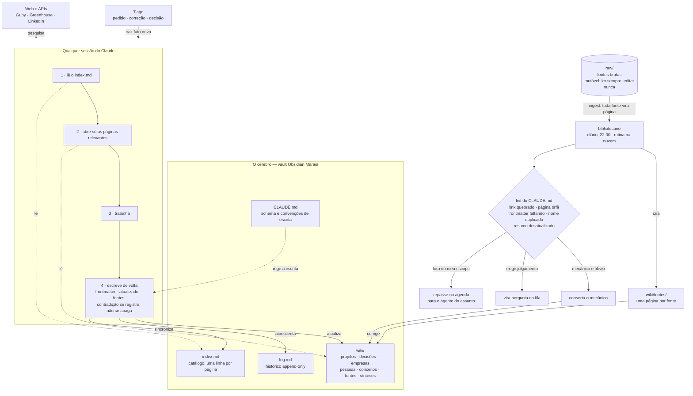
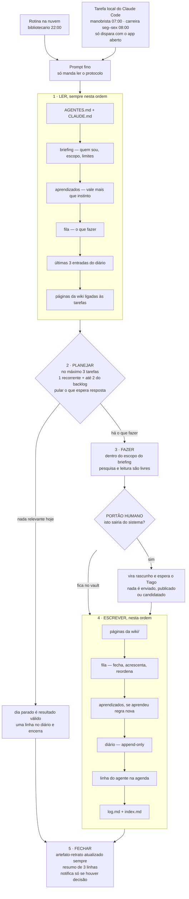
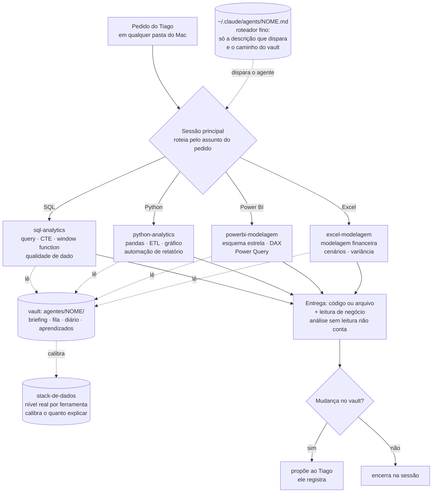

# Arquitetura do sistema de agentes

Sete agentes, duas classes, uma memória. Três fluxogramas do desenho que está rodando —
estado de 7 de outubro de 2026.

| | |
|---|---|
| Agendados (acordam sozinhos) | 3 — `bibliotecario` 22:00 · `carreira` seg–sex 08:00 · `manobrista` 07:00 |
| Sob demanda (chamados pelo assunto) | 4 — `sql-analytics` · `python-analytics` · `powerbi-modelagem` · `excel-modelagem` |
| Onde rodam | 1 como rotina na nuvem, 2 como tarefa local do Claude Code |
| Memória | um vault Obsidian, com briefing, fila, diário e aprendizados por agente |

## 1. O cérebro: o vault como memória, e o bibliotecario que o mantém

O modelo não lembra de nada entre uma execução e outra. O que faz o sistema ter memória é o vault — e o que impede o vault de apodrecer é um agente dedicado só a ele. O `bibliotecario` não produz conteúdo sobre a vida do Tiago: conserta, liga e ingere.

- O vault é a única fonte de verdade, e toda escrita passa pelas regras do `CLAUDE.md`.
- O que é mecânico o bibliotecario conserta; o que exige julgamento vira pergunta na fila; o que é de outro domínio vira repasse na agenda.
- Nada é apagado. Contradição se registra com as duas versões e as duas datas.

## 2. O agente agendado: cinco passos, sempre os mesmos

O prompt da tarefa agendada é fino de propósito: ele só manda ler o protocolo. Toda a inteligência mora no vault, então mudar o comportamento de um agente é editar um arquivo — não reconfigurar a tarefa, o que exigiria aprovação no computador.

- O passo 4 não é opcional: é o que faz o sistema aprender, já que entre duas execuções o agente não lembra de nada.
- O limite de três tarefas e o caminho "dia parado" existem para o agente não inventar trabalho — cada execução consome uso do plano.
- O `manobrista` acrescenta uma regra própria: trabalha por branch e pull request, nunca empurra na `main`. O `carreira` lê o painel de vagas no passo 1 e o republica no passo 5.

## 3. Os subagentes em stand-by: chamados pelo assunto, não pelo relógio

Os quatro agentes de dados não têm agendamento e não consomem nada sozinhos. Ficam parados até um pedido cair no escopo deles — e quem roteia é o assunto do pedido, dentro da sessão em que o Tiago já está trabalhando.

- A diferença de classe não é de ferramenta, é de autonomia: o agendado escolhe a própria tarefa e escreve no vault; o sob demanda recebe a tarefa pronta — o pedido *é* o plano — e nunca escreve no vault por conta própria.
- Os quatro entregam da mesma forma. A diferença é onde o resultado roda: SQL e Python executam na sessão; Power BI e Excel são aplicativos do Tiago, então a entrega é a medida DAX, a fórmula ou o `.xlsx` pronto para abrir.
- O roteador em `~/.claude/agents/` só aponta; o briefing que vale está no vault.

## As regras que valem para todos

1. **Não falam com ninguém pelo Tiago.** Nenhum envia email, mensagem, candidatura, comentário ou
   publicação. O que sairia do sistema vira rascunho e espera aprovação.
2. **Não apagam nada.** Nem as fontes brutas, nem páginas, nem fatos dentro delas. Corrige-se
   acrescentando, e a contradição fica registrada com as duas versões e datas.
3. **Não inventam.** Fato sem fonte não vira afirmação: vira `(confirmar)` ou pergunta na fila.
4. **Conteúdo do empregador é sempre genérico** — compliance: nenhum cliente, valor, deal ou
   projeto específico entra em arquivo, exemplo ou portfólio.
5. **Não mudam o próprio briefing** nem criam agentes novos. Podem propor, na fila.
6. **Não mexem na fila de outro agente** — o que é de escopo alheio vira repasse na agenda.
7. **Prompt fino, vault grosso.** O prompt externo só diz onde ler, porque mudar o prompt de uma
   rotina exige aprovação e mudar um arquivo do vault não.
