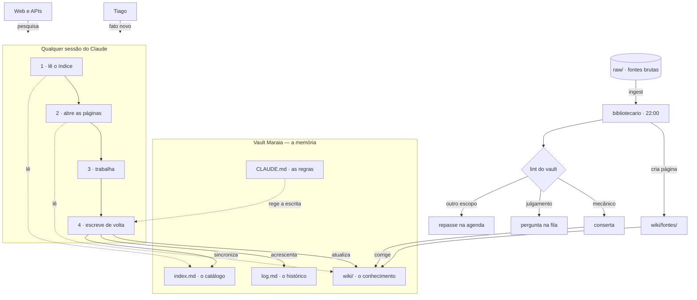
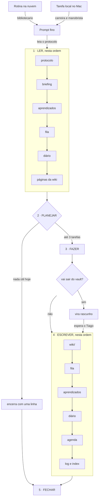
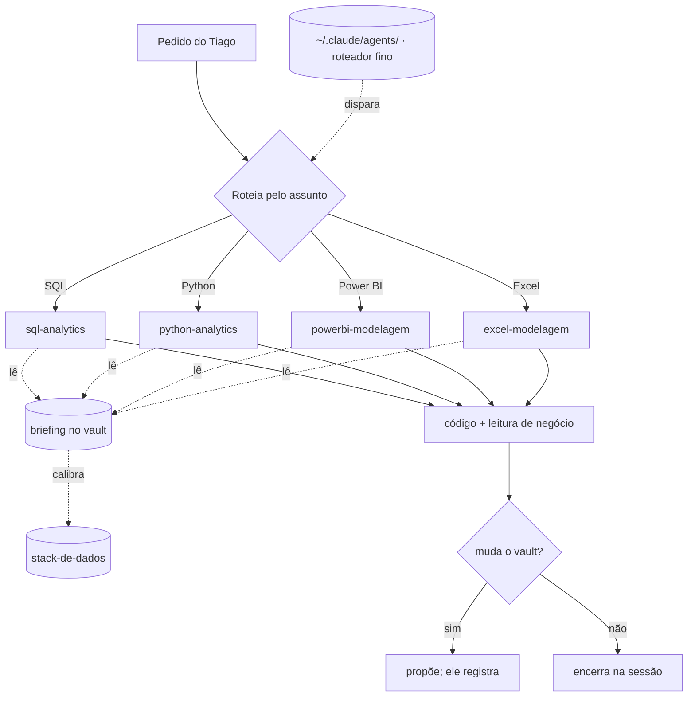

# Arquitetura do sistema de agentes

Sete agentes, duas classes, uma memória. Três fluxogramas do desenho que está rodando —
estado de 7 de outubro de 2026.

| | |
|---|---|
| Agendados (acordam sozinhos) | 3 — `bibliotecario` 22:00 · `carreira` seg–sex 08:00 · `manobrista` 07:00 |
| Sob demanda (chamados pelo assunto) | 4 — `sql-analytics` · `python-analytics` · `powerbi-modelagem` · `excel-modelagem` |
| Onde rodam | 1 como rotina na nuvem, 2 como tarefa local do Claude Code |
| Memória | um vault Obsidian, com briefing, fila, diário e aprendizados por agente |

## 1. O cérebro: o vault como memória, e o bibliotecario que o mantém

O modelo não lembra de nada entre uma execução e outra. O que faz o sistema ter memória é o vault — e o que impede o vault de apodrecer é um agente dedicado só a ele.

- `raw/` guarda as fontes brutas e é imutável: ler sempre, editar nunca.
- O passo 4 escreve com frontmatter, `atualizado:` e `fontes:`, preservando contradições.
- O lint procura link quebrado, página órfã, frontmatter faltando, nome duplicado e resumo desatualizado.

## 2. O agente agendado: cinco passos, sempre os mesmos

O prompt da tarefa é fino de propósito: só manda ler o protocolo. A inteligência mora no vault, então mudar comportamento é editar um arquivo, não reconfigurar a tarefa.

- Planejar é no máximo 3 tarefas: uma recorrente e até duas do backlog, pulando o que espera resposta do Tiago.
- As tarefas locais só disparam com o app Claude aberto; se o Mac estiver desligado, a execução acontece na abertura seguinte.
- Fechar atualiza o artefato-retrato do agente em toda execução, resume em 3 linhas e só notifica se houver decisão a tomar.

## 3. Os subagentes em stand-by: chamados pelo assunto, não pelo relógio

Os quatro agentes de dados não têm agendamento e não consomem nada sozinhos. Ficam parados até um pedido cair no escopo deles.

- O roteador em `~/.claude/agents/` tem só a descrição que dispara o agente e o caminho do vault; o briefing que vale está no vault.
- Os quatro entregam da mesma forma. A diferença é onde o resultado roda: SQL e Python executam na sessão; Power BI e Excel são aplicativos do Tiago, então a entrega é a medida DAX, a fórmula ou o `.xlsx` pronto.
- Sem agendamento, os quatro não consomem uso sozinhos.

## As regras que valem para todos

1. **Não falam com ninguém pelo Tiago.** O que sairia vira rascunho e espera aprovação.
2. **Não apagam nada.** Corrige-se acrescentando, com as duas versões e datas.
3. **Não inventam.** Fato sem fonte vira `(confirmar)` ou pergunta na fila.
4. **Conteúdo do empregador é sempre genérico** — compliance.
5. **Não mudam o próprio briefing** nem criam agentes novos. Podem propor, na fila.
6. **Não mexem na fila de outro agente** — vira repasse na agenda.
7. **Prompt fino, vault grosso.**
