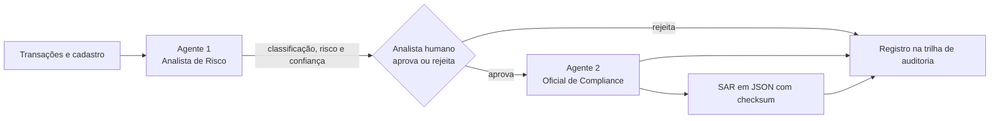

# Agentes de IA para serviços financeiros

Projetos da especialização **Agentic AI for Financial Services** (Udacity), em andamento. Cada módulo do curso tem um projeto agêntico diferente aplicado a finanças. Esta pasta mostra **arquitetura, decisões de desenho e resultados**. O código não é publicado, porque o material do curso é licenciado sob CC BY-NC-ND 4.0.

## Projeto 1 — TRACE: detecção de atividade suspeita e relatório de compliance

**Problema.** Um banco precisa revisar transações com sinal de risco e, quando for o caso, redigir um relatório de atividade suspeita (SAR) para o regulador. É trabalho repetitivo, sensível a erro e que exige trilha de auditoria.

**Base.** Dados sintéticos de um banco: 150 clientes, 178 contas e 4.268 transações.

**Arquitetura: dois agentes com uma decisão humana no meio.**

1. **Analista de Risco** — raciocínio em cinco passos fixos (dados → padrão → regulação → risco → classificação). Classifica o caso como *structuring*, sanções, fraude, lavagem de dinheiro ou outro, com nível de risco e confiança.
2. **Portão humano** — um analista aprova ou rejeita antes da redação. Mantém um responsável por cada registro e evita a chamada mais cara nos casos rejeitados.
3. **Oficial de Compliance** — ciclo de raciocínio e ação em oito passos; narrativa da SAR com até 120 palavras, cobrindo quem, o quê, quando, onde e por quê, com citação regulatória. O texto registra fatos ("as transações parecem estruturadas"), nunca conclusões ("o cliente está lavando dinheiro").
4. **Saída** — SAR em JSON com checksum SHA-256 e trilha de auditoria que inclui a decisão humana.

## Decisões de desenho

- **Controle antes de automação.** O agente não decide sozinho o que vai ao regulador: a aprovação humana é um passo do fluxo, não uma revisão opcional.
- **Auditável e reprodutível.** Cada passo fica registrado, e os agentes rodam com temperatura baixa para que o mesmo caso produza o mesmo resultado.
- **Falhar em vez de esconder.** Uma narrativa acima do limite de palavras gera erro, em vez de ser cortada em silêncio. Resposta mal formatada volta ao modelo com o erro, para nova tentativa.
- **Custo como decisão.** O sistema mede quantas chamadas ao modelo foram feitas e quantas foram evitadas pelo portão humano. O prompt agrega as transações e só detalha as que têm sinal.

## Como foi verificado

30 testes automatizados, mais um teste de ponta a ponta contra a API real. Validação de dados com Pydantic e checagem de integridade referencial na carga.

**Stack:** Python, Pydantic, API da OpenAI, pandas, pytest e Jupyter.

## Próximos projetos

Os módulos 2, 3 e 4 da especialização entram nesta pasta à medida que forem concluídos.
