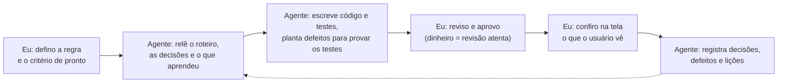

# Facility Digital — construção de um sistema de gestão com IA

Um sistema de gestão para uma operação de estacionamento, estruturado do zero e construído com um agente de IA que programa sob a minha direção e revisão.

| 13 de 23 | 30 | ~290 | 1 |
|---|---|---|---|
| marcos do roteiro concluídos | mudanças revisadas e aprovadas em dez dias | testes automatizados rodando a cada mudança | unidade-piloto em operação |

*Números de setembro de 2026.*

## Projeto

A operação controlava entrada, saída e caixa sem sistema: o fechamento do turno dependia de conferência manual, e não havia relatório para o gestor acompanhar faturamento, veículos no pátio ou divergência de caixa. O objetivo foi estruturar esse controle do zero, em duas pontas que conversam entre si:

- **Terminal da guarita:** entrada e saída de veículos, cálculo da tarifa, ticket com QR code e fechamento de caixa automático no fim do turno.
- **Painel de gestão:** indicadores, faturamento, relatórios com filtro por data e hora, exportação para Excel, conferência de caixa e alertas.

## Método — como o trabalho é dividido entre mim e o agente

Eu defino o problema, as regras de negócio e a prioridade. O agente de IA escreve o código e os testes. Nenhuma mudança entra no ar sem passar pela minha revisão.

- **Contexto antes de código.** A cada entrega o agente relê o roteiro, as decisões já tomadas e o diário das entregas anteriores.
- **Testes que provam alguma coisa.** Além de escrever os testes, o agente planta defeitos de propósito e confirma que os testes os detectam.
- **Entregue é o que o usuário vê.** Um marco só conta como concluído quando o resultado aparece funcionando na tela, não quando o código é aprovado.
- **Limites escritos.** O agente não altera dado da operação, não manipula credencial e não publica nada por conta própria. O que ele não pode fazer sozinho vira pergunta para mim, com uma recomendação.

## Decisões

- **O fechamento conta o que foi pago, não o que entrou.** Um carro que entra num turno e paga no outro precisa cair em um lugar só. Escolhi regime de caixa: o momento do pagamento é a chave de todo relatório financeiro.
- **Piloto em uma unidade antes de escalar.** Uma unidade roda por quatro a cinco meses antes de o sistema ir para as demais, uma por vez. Confiabilidade virou critério de aceite, acima de novas funções.
- **Trocar a base de dados enquanto o histórico era zero.** O armazenamento provisório funcionava, mas não aguentaria várias unidades. Antecipei a troca porque, sem histórico, a migração não custava nada; meses depois, custaria migrar o caixa de uma operação real.
- **Adiar pagamento integrado e impressão, com critério.** Maquininha e impressora térmica viraram módulos para depois de o sistema estar estável. O ticket digital com QR code resolve o piloto sem depender de hardware.
- **O sistema vai atrás do gestor.** Comparando com um produto maduro do mercado, faltava o alerta ativo. Hoje o painel avisa quando um fechamento não chega, em vez de esperar alguém abrir o relatório.

## Análise — dois defeitos que o processo pegou

**O alerta achou um problema no primeiro dia.** O alerta de fechamento não recebido disparou logo na estreia e revelou que um fechamento que falhava no envio não era reenviado. A correção passou a reenviar sem duplicar, e o dia perdido foi recuperado.

**Caixa em dobro, evitado antes de acontecer.** Ao passar o fechamento da unidade-piloto para o servidor, a revisão encontrou um caminho em que terminal e servidor poderiam fechar o mesmo período. Uma trava entrou antes de a mudança ir ao ar, com testes que provam que o caixa não duplica.

## Conclusão

O que o projeto mostra é o desenho do sistema de trabalho: o que a IA faz sozinha, onde a decisão humana é obrigatória, como cada entrega é verificada e como o que se aprende fica registrado para a próxima. É o mesmo raciocínio de controle que aplico em finanças: regra clara, trilha de auditoria e conferência antes de dar um número como certo.

---

*Detalhes de infraestrutura, segurança e código do sistema foram omitidos de propósito. O repositório do sistema é privado.*
